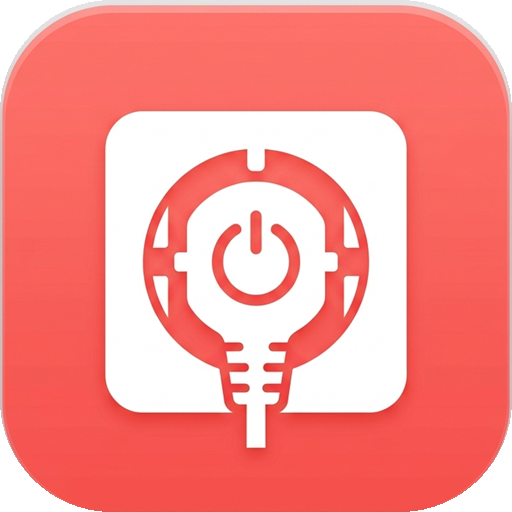

# 🌻 向日葵独立开关 (Sunlogin Switch)

<p align="center">
  
</p>

<p align="center">
  <strong>专为向日葵智能插座打造的极简独立控制客户端</strong>
</p>

<p align="center">
  <a href="https://github.com/MrcolorH/SunloginSwitch/releases"></a>
  
  
  
</p>

---

## 📖 项目简介

日常使用向日葵智能插座（如 P1 / P1Pro / P2 等）时，官方向日葵 App 体积庞大（上百兆）、集成了远程控制、桌面连接、广告与繁多业务，每次只是想开关一下电脑或电器电源，往往需要繁琐等待与多级点击。

**向日葵独立开关 App** 彻底剥离一切冗余组件，专注打造**即开即关、轻量秒开**的独立开关控制体验。

---

## ✨ 核心特性

- ⚡ **即点即控，秒级响应**
  - 主界面极简大开关，一键翻转通断电状态
  - 自动轮询与插座在线/离线状态实时感知
  - 完整实现向日葵动态加密校验签名算法，直连贝锐云端 API

- 🔐 **多种灵活登录方式**
  - 🌐 **官方网页免扫码登录（推荐）**：单台手机即可完成，内置贝锐官方认证中心，支持短信验证码 / 密码登录，登录成功全自动静默捕获凭据
  - 📷 **双机扫码登录**：生成官方授权二维码，另一台已登录向日葵 App 的手机扫码即可直接授权
  - 🔢 **设备 SN 码快速接入**：直接输入插座背部的 12 位 SN 序列号快速绑定控制
  - 📋 **Access Token 剪贴板一键登入**：支持粘贴控制台 Token，快速换取设备权限

- 🎨 **现代精致 Material 3 设计**
  - 暖阳红向日葵品牌主色调
  - 全屏高斯模糊毛玻璃与流畅微交互动画
  - 支持多设备快速切换与重命名备注

- 🪶 **超轻量与隐私安全**
  - 安装包体积优化至仅 **约 18 MB**（相比原版百兆体积缩减 80%+）
  - 绝无任何广告、推送或后台驻留服务
  - 所有 Token 与设备信息均保存在手机本地安全存储，不经过任何第三方服务器

---

## 📲 下载与安装

请前往 [**GitHub Releases**](https://github.com/MrcolorH/SunloginSwitch/releases) 下载最新编译好的 APK 安装包：

| 架构 / 文件 | 说明 | 适用机型 |
| :--- | :--- | :--- |
| `SunloginSwitch-arm64.apk` | 64 位优化版 (推荐) | 近年主流绝大多数 Android 手机 |
| `app-armeabi-v7a-release.apk` | 32 位通用版 | 较老款设备或 32 位系统 |

---

## 🛠️ 本地编译构建

若希望自行从源码构建应用：

### 前置要求
- [Flutter SDK](https://flutter.dev/) (>= 3.20.0)
- Android SDK (API Level >= 21)
- Java 17+

### 编译步骤
```bash
# 1. 克隆代码仓库
git clone https://github.com/MrcolorH/SunloginSwitch.git
cd SunloginSwitch

# 2. 安装依赖包
flutter pub get

# 3. 编译发布版 APK (支持多架构拆分与代码混淆)
flutter build apk --release --split-per-abi --obfuscate --split-debug-info=build/symbols

# 构建产物位于:
# build/app/outputs/flutter-apk/app-arm64-v8a-release.apk
```

---

## 🔒 隐私与免责声明

1. 本项目为开源第三方独立控制客户端，仅供个人技术交流与日常便捷控制使用。
2. “向日葵”及相关商标所有权归上海贝锐信息科技股份有限公司所有。
3. 本项目不采集、不存储、不上传用户的任何账号与密码信息至第三方服务器，所有通信均直接连接贝锐官方开放接口。

---

## 📄 开源许可证

本项目基于 [MIT License](LICENSE) 开源。
